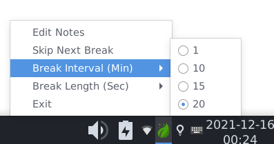

# q-break-reminder

## Dependancies

### Debian

* OpenGL: `sudo apt-get install libgl-dev`
* VAAPI: `sudo apt install libva-dev`

## Introduction
A cross-platform "Take a break" reminder implementing a few variants of the 20-20-20 rule in C++/Qt.

## Screenshots

